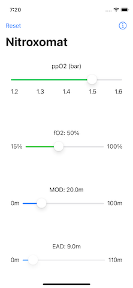

![Nitroxomat][Nitroxomat-logo]

[![badge-language]][swift.org]

# Nitroxomat

Simple app that shows relation between maximum ppO2, breathing gas mix
and maximum depth.

## A Thousand Words ..

## License

This work is licensed under a [Creative Commons Attribution-Non Commercial-ShareAlike 4.0 International License](http://creativecommons.org/licenses/by-nc-sa/4.0/).

[Nitroxomat-logo]: https://github.com/borisboesler/Nitroxomat/raw/master/ReadMeImages/Nitroxomat-logo.png
[swift.org]: https://swift.org/
[license]: http://creativecommons.org/licenses/by-nc-sa/4.0/

[badge-language]: https://img.shields.io/badge/Swift-4.x%20%7C%205.x-orange.svg?style=flat
